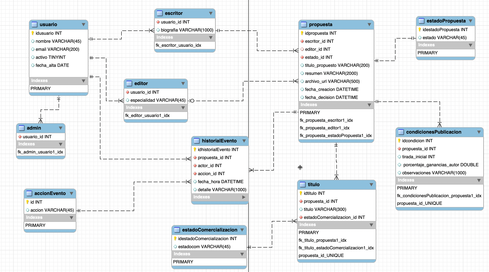
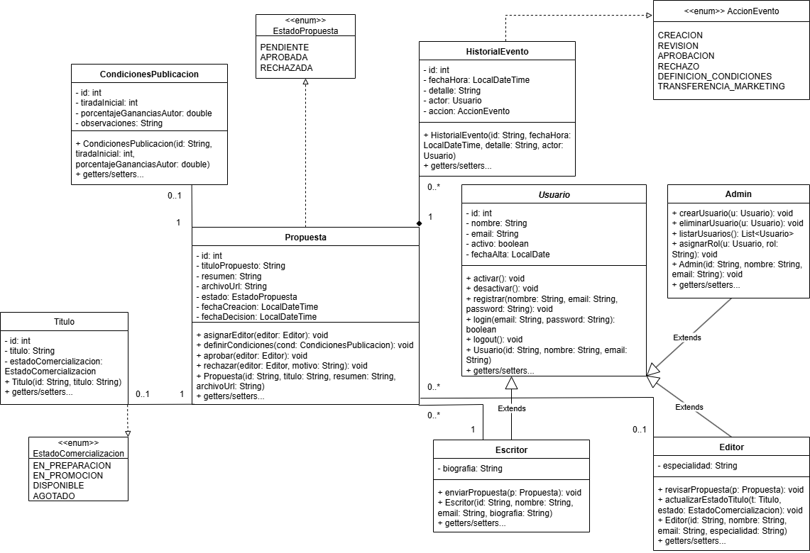
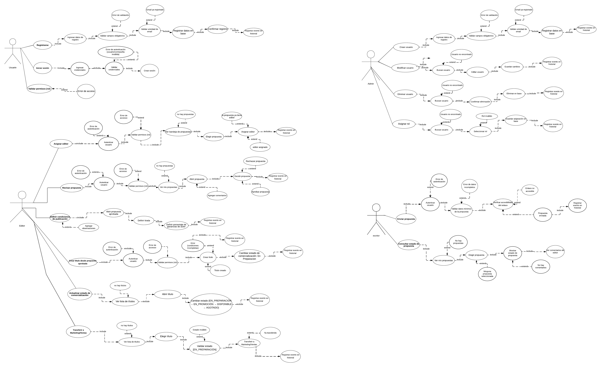

# LibreriaYenny_Propuestas

**El objetivo** del sistema es permitir la recepción y gestión de propuestas de libros de escritores independientes, ofreciendo un flujo claro para que un editor pueda revisarlas, aprobarlas y definir condiciones de publicación.  

[Entrevista](https://docs.google.com/document/d/1RARpc2UAuXOTVtFqxE5c8nCJ_QGm4yDCCk1khrxe5eQ/edit?usp=sharing)   
[SRS](https://docs.google.com/document/d/1G89TTCJxgDt-6j8wb6e_xkjXm9HBr1P6xS6EWzMkhKQ/edit?usp=sharing)    

**Diagrama de entidad**  

**Diagrama de clases**  

**Diagrama de casos de uso**

